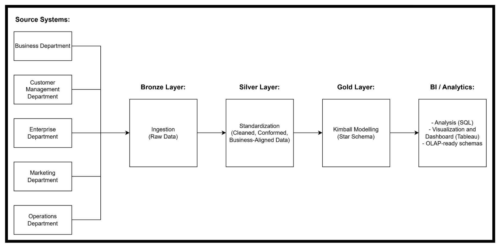
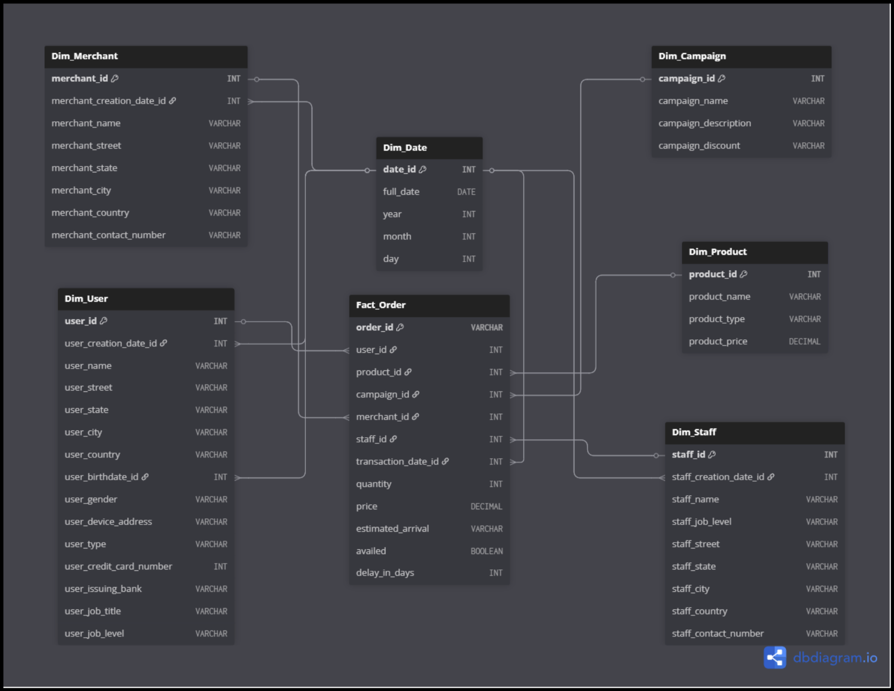
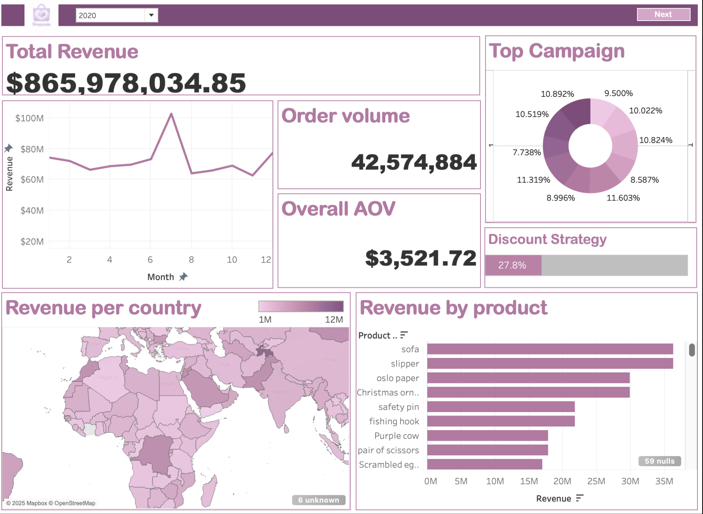
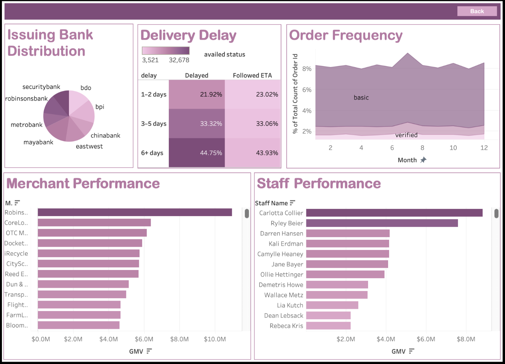

# ShopZada-Data-Warehouse - Dashboard-

View the interactive Tableau dashboard here:  
https://public.tableau.com/views/DMW-FinalDashboard/Dashboard1?:language=en-US&:sid=&:redirect=auth&:display_count=n&:origin=viz_share_link

> **Note:** The complete Kimball Data Warehouse implementation, including the full medallion architecture and ETL pipeline, is available in a separate repository: `dwh_finalproject_3DSA_group_group5`

A Business Intelligence and Data Visualization dashboard analyzing ShopZada’s sales, campaigns, revenue trends, merchant performance, customer behavior, logistics efficiency, and banking partnerships using Tableau and pgAdmin with a medallion architecture approach.

For the data visualization and BI, Tableau software was utilized. Access to the bronze database containing all medallion layers was established by connecting Tableau to pgAdmin, specifically by using a PostgreSQL driver.

The Top Campaign chart aims to provide insights into the business question: How effective are the campaign strategies and their associated discount rates at driving more sales? It seeks to determine which campaign approach has the highest order availed rate and generates the most orders. 

Moving on, the Discount Strategy is the percentage that seeks to identify which discount percentage significantly impacts the rate of orders that availed themselves of the campaign, given that the discount strategy approach leads to more engagement and eventually a higher purchase rate. To provide an overall performance evaluation of ShopZada's total revenue, the evaluation aims to offer an overview of the total revenue for a selected year and how the revenue trends across months. Is January the peak month, or is there a sudden drop in revenue in a year that needs further analysis? 

Order Volume and Average Order Value KPIs seek to address the business question: what is the total orders shipped out, and what leads to the significant revenue growth, is it the high volume of orders or the high average order value, and does the AOV KPI match what the total revenue trend chart is trying to visualise? 

Then, the Revenue Per Country aims to provide a geographic breakdown of which countries generate the highest revenue. Are there any geographic patterns in revenue contributions? Which country is promising for market expansion or needs improvement in its marketing strategy approach? 

Lastly, Revenue per Product, the business aims to identify which specific products no longer generate sales and will eventually need to be discontinued or have their price value reduced. It also aims to determine whether the revenue growth was due to a few products or the spread across many. and which specific products need more concentration when it comes to production and campaigns.

The Issuing Bank Distribution shows how completed transactions are shared among ShopZada’s main partner banks BDO, BPI, Chinabank, EastWest, and Maybank. This shows the existing banking partnerships and also points to possible opportunities to improve payment efficiency.
The Delivery Delay Analysis focuses on how well orders are fulfilled by comparing on-time deliveries with those that experience delays. A large portion of delayed orders falls into the six-days-or-more category, which signals potential issues in logistics operations or the performance of third-party couriers. 

The Order Frequency Trend tracks monthly order activity as a share of total orders and distinguishes between basic and verified users. Throughout the year, basic users consistently place most of the orders, while verified users contribute a smaller but stable portion. This trend offers insight into customer engagement and purchasing behavior.

The Merchant Performance view ranks merchants based on gross merchandise value (GMV) and highlights those that generate the highest revenue. The results show that a small number of merchants account for a large share of total GMV, indicating a concentration of revenue among top sellers. This emphasizes the importance of maintaining strong relationships with key merchants while also supporting the growth of mid-tier sellers to create a more balanced and resilient marketplace.

The Staff Performance analysis ranks staff members according to the GMV associated with the orders they manage. Top performers stand out clearly, allowing management to recognize strong contributions, identify areas where performance may need support, and ensure workloads are distributed fairly. 

